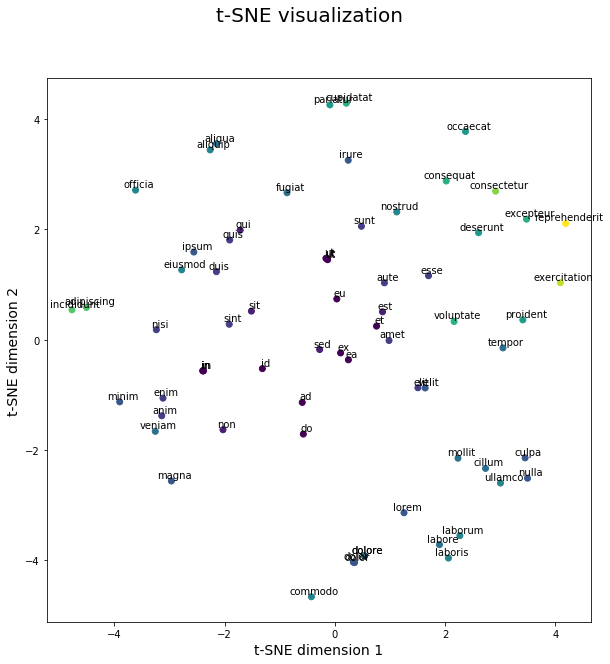

# Very-simple-t-SNE-text-visualization
A simple python script to show similarities between words. 

## Installation

You can install [MulticoreTSNE](https://github.com/DmitryUlyanov/Multicore-TSNE) using pip:
```
pip install MulticoreTSNE
```
Currently, for Windows it requires compilation, but the older version can be installed without compilation: 
```
pip install MulticoreTSNE==0.0.1.1
```

## Usage

You can replace the text in `data.txt` with yours and run all cells in Jupyter Notebook

## Example output
<center></center>
